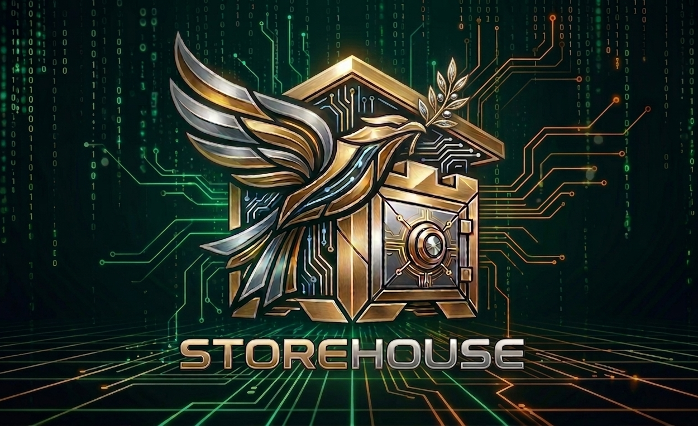

<p align="center">
  
</p>

<p align="center">
  <em>"Bring the whole tithe into the storehouse, that there may be food in my house."</em><br />
  — Malachi 3:10
</p>

---

# Storehouse

**An autonomous stablecoin stewardship agent on Arc.**

When USDC arrives, Storehouse reasons about where it belongs. It classifies the income, allocates it across a household's registered financial obligations — tithe, tax escrow, savings, operating remainder — executes the transfers on-chain, and explains every decision in plain English.

Live on Arc Testnet: **[mystorehouse.ai](https://mystorehouse.ai)**

---

## The problem

Most people intend to be disciplined with money. Set aside the tithe. Reserve for taxes. Fund savings before spending. The intent survives until the money lands in one undifferentiated balance and gets spent on whatever came first.

Traditional automation handles this with fixed rules — move $X on the 1st. That breaks the moment income is irregular, or an obligation changes, or the split needs judgment rather than arithmetic.

Storehouse treats allocation as a **reasoning** problem. An LLM classifies each inbound payment against the user's declared obligations and proposes a routing plan; deterministic code validates that plan against hard constraints before anything moves. The agent explains what it did and why, in language a person can actually audit.

## How it works

```
Inbound USDC (Arc Testnet)
        │
        ▼
Circle webhook  ──►  income event recorded
        │
        ▼
Classification + routing  (Claude Haiku proposes)
        │
        ▼
Validation  (deterministic code checks the plan)
        │
        ▼
Execution  (Circle Developer-Controlled Wallets)
        │
        ├──► tithe        (10%)
        ├──► tax escrow   (25%)  — capital-certainty constraints apply
        ├──► savings      (10%)  — diversification leg: half swapped USDC→EURC
        └──► operating    (remainder)
        │
        ▼
Plain-English explanation written to the dashboard
```

**LLM proposes, code validates.** The model never has unilateral authority to move funds. It produces a routing proposal; validation logic enforces the invariants (allocations sum correctly, obligation ceilings respected, tax escrow never routed anywhere without instant withdrawability). A proposal that fails validation is rejected, not executed.

## What's built

- **Autonomous routing pipeline** — inbound USDC detected via verified Circle webhook, classified, allocated, and executed across five Developer-Controlled Wallets
- **Savings diversification** — after the savings leg confirms, half is swapped USDC→EURC via Arc App Kit, logged, and surfaced on the dashboard. Fails safe to USDC.
- **Plain-English decision log** — every routing decision is stored with its reasoning and rendered in a lifecycle view
- **Dashboard** — obligations, bucket balances, and recent activity, deployed on Netlify at a custom domain
- **`YieldProvider` interface** — swappable yield venues behind a common interface, so changing where a bucket earns is a configuration change rather than a rewrite. Tax escrow is pinned to `none` pending an instant-withdrawal guarantee.
- **`OfframpAdapter` interface** — partner-agnostic fiat off-ramp abstraction, with adapter stubs written against Crossmint and Coinbase Business

## What's researched but not yet built

Being explicit about the line between shipped and designed:

- **Cross-chain yield routing.** Destination venues have been validated on-chain (not from documentation) and written up in [`docs-planning/`](docs-planning/) — which lending and liquidity venues are actually deployed, callable, and liquid on testnet, which are mainnet-only, and where bridged USDC is stranded. Execution of the cross-chain legs is in progress.
- **Risk-graded routing.** The design: the user's risk appetite, captured during onboarding, selects which validated paths a bucket may route to, and any higher-risk selection requires an acknowledged, path-specific plain-English caution before it executes.
- **Fiat off-ramp.** Architecture confirmed (Arc → CCTP → destination chain → off-ramp partner → ACH) behind the `OfframpAdapter`, with sandbox rails evaluated. Not yet wired end to end.

## Stack

| | |
|---|---|
| Chain | Arc Testnet (Circle's stablecoin-native L1) |
| Wallets | Circle Developer-Controlled Wallets |
| Swaps | Arc App Kit (`@circle-fin/app-kit`) |
| Cross-chain | CCTP / Gateway |
| Reasoning | Claude (Haiku for classification and routing) |
| App | Next.js 16, TypeScript |
| State | Supabase (Postgres) |
| Hosting | Netlify |

## Provenance

Storehouse was scaffolded from a fork of [`circlefin/arc-commerce`](https://github.com/circlefin/arc-commerce), Circle's sample application, to start from working Circle SDK, Supabase, and webhook plumbing rather than rebuilding it. This is stated openly because it is an engineering decision, not something to obscure.

**Kept:** Circle SDK wrappers, Supabase client setup, webhook signature verification, Next.js configuration.

**Replaced:** the entire data model (obligations, buckets, routing decisions, income events — none of which existed upstream), the routing and reasoning layer, and the dashboard.

**Removed:** the commerce feature set — credit purchasing, admin dashboard, auth flows, and the unused UI component library that came with them. The husk removal was a single deliberate commit deleting roughly 8,000 lines.

The commit history is intact from the fork forward and is meant to read as a record of construction.

## Running locally

```bash
git clone https://github.com/Hudgins333/MyStorehouse.git
cd MyStorehouse
npm install
cp .env.example .env.local   # fill in your own values
npm run dev
```

Requires Node 22+ (`nvm use` reads `.nvmrc`), a Supabase project, and Circle Developer-Controlled Wallets credentials (API key + entity secret). Database migrations live in `supabase/`; apply with `npx supabase migration up` from the project root.

For local webhook testing, expose the dev server with `ngrok http 3000` and register the HTTPS URL at Circle Console → Webhooks as `/api/circle/webhook`.

## Documentation

- [`docs-planning/PROJECT-STATUS.md`](docs-planning/PROJECT-STATUS.md) — build state, key decisions, and the reasoning behind them
- [`CIRCLE-FEEDBACK.md`](docs-planning/CIRCLE-FEEDBACK.md) — a running log of real bugs and gaps encountered against Circle's developer tools, documented as they were found
- [`scripts/`](scripts/) — on-chain probe scripts used to validate yield venues before committing build time to them

## Status and scope

Testnet only. Secrets are handled through environment variables. Webhook signatures are verified. This is a working prototype under active development and is not production software.

---

<p align="center"><em>To Christ be the Glory.</em></p>
